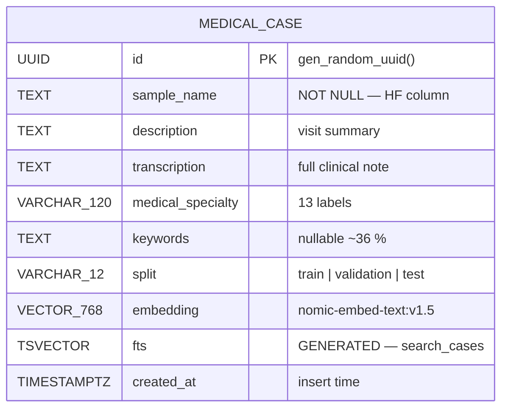
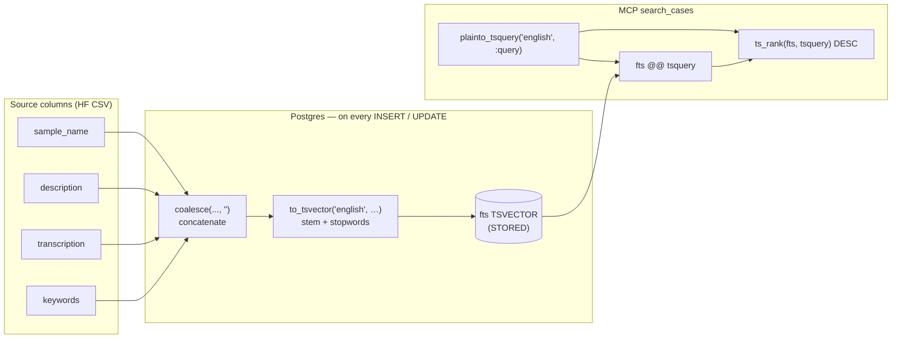
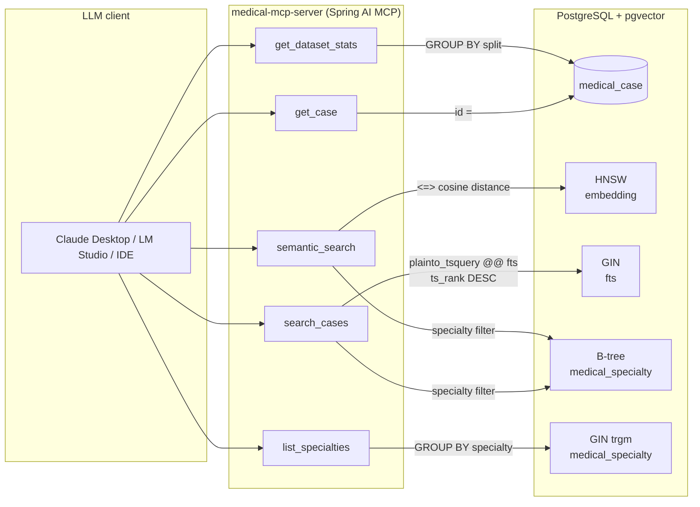

# Design
## Detailed Design (schema, services, MCP)

**Version:** 2.0.0  
**Requirements:** [01-requirements.md](01-requirements.md) · [02-architecture.md](02-architecture.md)

## Embedding Model

Defaults align with [`med-expert-match-ce`](https://github.com/berdachuk/med-expert-match-ce) GraphRAG embeddings: **Ollama** serving **`nomic-embed-text:v1.5`** at **768 dimensions**. Use Ollama model tags (not LM Studio display names). Do not mix embedding models with different dimensions in the same database.

**No Spring AI embedding auto-configuration** — mirror `med-expert-match-ce`: exclude `OpenAiEmbeddingAutoConfiguration`, set `spring.ai.openai.enabled: false`, and wire embeddings manually via **`EmbeddingEndpointPool`**. The pool is **always used** for every embed call (loader pass 2, `semantic_search`). At least one endpoint must be configured; startup fails if `endpoints` is empty.

Shared embedding credentials (`EMBEDDING_*` env → `spring.ai.custom.embedding.*`):

```yaml
spring:
  ai:
    openai:
      enabled: false
    custom:
      embedding:
        api-key: ${EMBEDDING_API_KEY:none}
        dimensions: ${EMBEDDING_DIMENSIONS:768}
```

Pool (`medicalmcp.embedding.multi-endpoint` — **required**; minimum one endpoint):

```yaml
medicalmcp:
  embedding:
    multi-endpoint:
      endpoints:                       # @NotEmpty — at least one entry required
        - url: ${EMBEDDING_BASE_URL:http://localhost:11434}
          model: ${EMBEDDING_MODEL:nomic-embed-text:v1.5}
          priority: 1
        # Additional nodes (optional; same model + dimensions):
        # - url: http://192.168.0.73:11434
        #   model: nomic-embed-text:v1.5
        #   priority: 2
        #   workers: 2
      skip-duration-min: ${MEDICALMCP_EMBEDDING_MULTI_ENDPOINT_SKIP_MIN:10}
      worker-per-endpoint: ${MEDICALMCP_EMBEDDING_MULTI_ENDPOINT_WORKERS:1}
      api-batch-size: ${MEDICALMCP_EMBEDDING_MULTI_ENDPOINT_API_BATCH_SIZE:50}
```

`EmbeddingEndpointPoolConfig` builds one `OpenAiEmbeddingModel` per endpoint using `OpenAiEmbeddingOptions.builder().baseUrl(...).model(...).dimensions(...)`. `normalizeOpenAiBaseUrl()` appends `/v1` when constructing each model — same helper as `med-expert-match-ce`.

Environment variables (same names as `med-expert-match-ce`):

```bash
EMBEDDING_BASE_URL=http://localhost:11434
EMBEDDING_API_KEY=none
EMBEDDING_MODEL=nomic-embed-text:v1.5
EMBEDDING_DIMENSIONS=768
```

Pull on the Ollama host: `ollama pull nomic-embed-text:v1.5`

---

---

## Database Schema

Single table. Vector dimension is **768** (nomic-embed-text:v1.5). HNSW index — at 2,464 rows it builds in seconds and outperforms IVFFlat.

```sql
-- V1__init_medical_cases.sql
CREATE EXTENSION IF NOT EXISTS vector;
CREATE EXTENSION IF NOT EXISTS pg_trgm;

CREATE TABLE medical_case (
    id                UUID        PRIMARY KEY DEFAULT gen_random_uuid(),
    sample_name       TEXT        NOT NULL,
    description       TEXT,
    transcription     TEXT,
    medical_specialty VARCHAR(120),
    keywords          TEXT,
    split             VARCHAR(12),   -- 'train' | 'validation' | 'test'
    embedding         VECTOR(768),   -- nomic-embed-text:v1.5
    fts               TSVECTOR GENERATED ALWAYS AS (
                          to_tsvector('english',
                              coalesce(sample_name,   '') || ' ' ||
                              coalesce(description,   '') || ' ' ||
                              coalesce(transcription, '') || ' ' ||
                              coalesce(keywords,      ''))
                      ) STORED,
    created_at        TIMESTAMPTZ DEFAULT now()
);

-- ANN index: HNSW cosine (correct for nomic-embed-text normalised output)
CREATE INDEX idx_medical_case_embedding
    ON medical_case USING hnsw (embedding vector_cosine_ops)
    WITH (m = 16, ef_construction = 64);

-- Full-text
CREATE INDEX idx_medical_case_fts
    ON medical_case USING GIN (fts);

-- Specialty filter (used in pre-filter before ANN)
CREATE INDEX idx_medical_case_specialty
    ON medical_case (medical_specialty);

-- Trigram index for LIKE / iLIKE specialty search
CREATE INDEX idx_medical_case_specialty_trgm
    ON medical_case USING GIN (medical_specialty gin_trgm_ops);
```

### Table at a glance



### Column reference

| Column            | Type             | Source / role                                                                                          |
|-------------------|------------------|---------------------------------------------------------------------------------------------------------|
| `id`              | `UUID` PK        | Generated by `gen_random_uuid()` on insert — HF has no UUID. Stable handle for `get_case` / resources. |
| `sample_name`     | `TEXT` NOT NULL  | HF column. **Not unique** — always look up cases by `id`.                                              |
| `description`     | `TEXT`           | Short visit summary. Feeds both the `case-analysis(focus=description)` prompt and the embedding text.   |
| `transcription`   | `TEXT`           | Full clinical note. Returned only by `get_case` and the `case-analysis(focus=transcription)` prompt.   |
| `medical_specialty` | `VARCHAR(120)` | One of 13 labels. Indexed for pre-filtering before FTS/ANN; trigram index for fuzzy specialty matching. |
| `keywords`        | `TEXT`           | Nullable (~36 % of HF rows). Concatenated into the embedding text.                                     |
| `split`           | `VARCHAR(12)`    | `train` \| `validation` \| `test`. Populated by `DatasetLoaderService.inferSplit` from the source URL. |
| `embedding`       | `VECTOR(768)`    | `nomic-embed-text:v1.5` of `{sampleName}. {description} {keywords}`. **Excludes** `transcription`.    |
| `fts`             | `TSVECTOR`       | Generated column — see [§The `fts` column](#the-fts-column). Used by `search_cases` only.              |
| `created_at`      | `TIMESTAMPTZ`    | Insert time. Used for stable ordering in the embedding pass and in tests.                               |

### Indexes

| Index                              | Purpose                                                                                  | Used by                                  |
|------------------------------------|------------------------------------------------------------------------------------------|------------------------------------------|
| `idx_medical_case_embedding` (HNSW, cosine) | ANN search on `nomic-embed-text` normalised output (`m=16`, `ef_construction=64`) | `semantic_search`                        |
| `idx_medical_case_fts` (GIN)       | Lexical lookups + ranking on the generated `tsvector`                                   | `search_cases`                           |
| `idx_medical_case_specialty`       | B-tree on the exact specialty label — used as a pre-filter before ANN/FTS               | `search_cases`, `semantic_search`, stats |
| `idx_medical_case_specialty_trgm`  | Trigram index for `ILIKE` / fuzzy specialty matching                                    | `list_specialties`, stats                |

`server.port`-side tuning for the HNSW index is set at connection time in [application.yml:41](application.yml) — `SET hnsw.ef_search = 40` runs on every new Hikari connection, trading recall for query speed.

### The `fts` column

`fts` is a **generated** `TSVECTOR` column — Postgres computes and stores it on every `INSERT` / `UPDATE` from the concatenation of `sample_name + description + transcription + keywords`, using the English text-search configuration:

```sql
fts TSVECTOR GENERATED ALWAYS AS (
    to_tsvector('english',
        coalesce(sample_name,   '') || ' ' ||
        coalesce(description,   '') || ' ' ||
        coalesce(transcription, '') || ' ' ||
        coalesce(keywords,      ''))
) STORED
```



`search_cases` (MCP tool) uses it in three ways:

1. **Lexical matching with stemming.** `plainto_tsquery('english', :query)` turns the user's text into a normalised query (e.g. "interrogating the pacemaker" → `pacemaker & interrog` — the English stemmer strips `-ing`/`-ation`). The `@@` operator matches it against `fts`, so a user typing "interrogating the pacemaker" still hits rows that say "interrogation".
2. **Ranking.** `ts_rank(fts, …) DESC` orders hits by relevance. Without `tsvector`, you'd have to `ILIKE '%term%'` per field, which can't rank and can't stem.
3. **Index-backed speed.** The GIN index on `fts` makes `@@` sub-millisecond on 2,464 rows and scales to millions without seq scans. `ILIKE` would always seq-scan.

The `transcription` field is included in `fts` but **excluded** from the embedding text — see [§Embedding text strategy](#embedding-text-strategy) below. That asymmetry is intentional: long transcriptions make good keyword search but bad vector signal.

Why **generated** rather than computed in Java:

- **Single source of truth.** Application code can't drift from the index — Postgres always recomputes `fts` when the underlying text changes.
- **No application-side tokenization.** The English stopword list, lowercasing, and stemming are Postgres' job; no Lucene/Elasticsearch sidecar.
- **Storage is cheap.** `STORED` keeps the tsvector on disk (vs `VIRTUAL`, which computes on read), so `@@` lookups are pure index seeks with no row reconstruction.

### How the table maps to the MCP surface



| MCP operation                          | SQL file                                                                                                  |
|----------------------------------------|-----------------------------------------------------------------------------------------------------------|
| `search_cases`                         | [sql/medicalcase/fullTextSearch.sql](../src/main/resources/sql/medicalcase/fullTextSearch.sql)             |
| `semantic_search`                      | [sql/medicalcase/semanticSearch.sql](../src/main/resources/sql/medicalcase/semanticSearch.sql)             |
| `get_case`                             | [sql/medicalcase/selectById.sql](../src/main/resources/sql/medicalcase/selectById.sql)                     |
| `list_specialties`                     | [sql/medicalcase/listSpecialties.sql](../src/main/resources/sql/medicalcase/listSpecialties.sql)           |
| `get_dataset_stats`                    | [sql/medicalcase/countBySplit.sql](../src/main/resources/sql/medicalcase/countBySplit.sql)                 |
| Loader pass 1 (insert from CSV)        | [sql/medicalcase/insert.sql](../src/main/resources/sql/medicalcase/insert.sql)                             |
| Loader pass 2 (find rows without vector)| [sql/medicalcase/findWithoutEmbeddingsBySplit.sql](../src/main/resources/sql/medicalcase/findWithoutEmbeddingsBySplit.sql) |
| Loader pass 2 (write vectors)          | [sql/medicalcase/updateEmbedding.sql](../src/main/resources/sql/medicalcase/updateEmbedding.sql)           |

### Embedding text strategy

Concatenate fields in descending clinical weight, matching the `med-expert-match-ce` prompts pattern:

```
{sample_name}. {description} {keywords}
```

`transcription` is intentionally excluded from the embedding input — it is too long (avg 600+ tokens) and would dominate the vector signal. FTS over `transcription` covers keyword retrieval. Skip null/empty `keywords` when building embed text (~36 % of HF rows).

---

## Domain Records (`medicalcase/domain`)

```java
// Zero framework dependencies — pure Java 21

public record MedicalCase(
    UUID   id,
    String sampleName,
    String description,
    String transcription,
    String medicalSpecialty,
    String keywords,
    String split,
    Instant createdAt
) {}

public record CaseSummary(         // Returned by list/search tools (no transcription)
    UUID   id,
    String sampleName,
    String description,
    String medicalSpecialty,
    String keywords,
    String split
) {}

public record SemanticMatch(
    CaseSummary caseSummary,
    double similarity
) {}

public record SpecialtyCount(
    String specialty,
    long   count
) {}

public record DatasetStats(
    long totalCases,
    Map<String, Long> bySpecialty,
    Map<String, Long> bySplit
) {}
```

---

## Application modules (implementation)

### `medicalcase` — repository API + JDBC impl

```java
// medicalcase/repository/MedicalCaseRepository.java — public API
public interface MedicalCaseRepository {
    Optional<MedicalCase> findById(UUID id);
    List<CaseSummary> fullTextSearch(String query, String specialty, String split, int limit);
    List<SpecialtyCount> listSpecialties();
    long countAll();
    void insertBatch(List<MedicalCase> cases);
    void updateEmbeddingsBatch(Map<UUID, float[]> embeddings);
}

// medicalcase/repository/impl/MedicalCaseRepositoryImpl.java
@Repository
public class MedicalCaseRepositoryImpl implements MedicalCaseRepository {
    private final NamedParameterJdbcTemplate jdbc;
    // SQL via @InjectSql("classpath:sql/medicalcase/...") or inline constants
}
```

### `retrieval` — vector + stats service

```java
// retrieval/service/VectorSearchService.java
public interface VectorSearchService {
    List<SemanticMatch> semanticSearch(float[] embedding, String specialty, int topK, double minSimilarity);
    DatasetStats getDatasetStats();
}

// retrieval/service/impl/VectorSearchServiceImpl.java
@Service
public class VectorSearchServiceImpl implements VectorSearchService {
    private final MedicalCaseRepository repository;
    // pgvector cosine SQL; stats aggregates via repository
}
```

### `MultiEndpointEmbeddingProperties`

```java
@ConfigurationProperties(prefix = "medicalmcp.embedding.multi-endpoint")
@Validated
public class MultiEndpointEmbeddingProperties {
    @NotEmpty
    @Valid
    List<EndpointConfig> endpoints;  // minimum 1; url @NotBlank per entry
    int skipDurationMin = 10;
    int workerPerEndpoint = 1;
    int apiBatchSize = 50;

    static class EndpointConfig {
        @NotBlank String url;
        String model;
        int priority = 0;
        Integer workers;
    }
}
```

### `EmbeddingEndpointPool` — multi-endpoint worker pool

Port of [`med-expert-match-ce` `EmbeddingEndpointPool`](https://github.com/berdachuk/med-expert-match-ce/blob/main/src/main/java/com/berdachuk/medexpertmatch/embedding/multiendpoint/EmbeddingEndpointPool.java):

```java
// embedding/multiendpoint/EmbeddingEndpointPool.java

// Shared task queue; worker-per-endpoint threads pull batches
// embed(String) → CompletableFuture<List<Double>>
// embedBatch(List<String>) → List<CompletableFuture<...>>  (groups by api-batch-size)
// Failed endpoint skipped for skip-duration-min, then auto-retried
// @PreDestroy shutdown with 30s drain
```

### `EmbeddingEndpointPoolConfig` — manual OpenAiEmbeddingModel wiring

```java
@Configuration
public class EmbeddingEndpointPoolConfig {

    @Bean
    EmbeddingEndpointPool embeddingEndpointPool(
            MultiEndpointEmbeddingProperties properties,
            Environment environment) {
        // Read spring.ai.custom.embedding.api-key + dimensions
        // Sort endpoints by priority; skip entries with blank url
        // Per endpoint: OpenAiEmbeddingModel(MetadataMode.EMBED, OpenAiEmbeddingOptions.builder()...)
        // normalizeOpenAiBaseUrl(url) → append /v1 if missing
        // throw IllegalStateException if no valid endpoints remain after filtering
        return new EmbeddingEndpointPool(endpointStates, workersPerEndpoint,
                properties.getSkipDurationMin(), properties.getApiBatchSize());
    }
}
```

### `EmbeddingService` — delegates to pool

```java
// embedding/service/EmbeddingService.java — public API (same role as med-expert-match-ce)
public interface EmbeddingService {
    float[] embedAsFloatArray(String text);
    List<float[]> embedBatch(List<String> texts);
    String buildEmbeddingInput(CaseSummary summary);
}

// embedding/service/impl/EmbeddingServiceImpl.java
@Service
public class EmbeddingServiceImpl implements EmbeddingService {
    private final EmbeddingEndpointPool pool;  // required — pool always present
    // embed → pool.embed(text); batch → pool.embedBatch(texts)
}
```

### `dataset` — loader service

```java
// dataset/service/DatasetLoaderService.java
public interface DatasetLoaderService {
    void loadIfEmpty();
}

// dataset/service/impl/DatasetLoaderServiceImpl.java — CommandLineRunner delegate
@Service
public class DatasetLoaderServiceImpl implements DatasetLoaderService {
    private final MedicalCaseRepository repository;
    private final EmbeddingService embeddingService;
    // idempotent COUNT(*) > 0 guard; two-pass load
}
```

**Loader flow** (idempotent — skips when `COUNT(*) > 0`):

```
Pass 1:
  1. Download CSV from HuggingFace (medical_cases_train.csv, medical_cases_validation.csv, medical_cases_test.csv)
  2. Parse CSV; assign UUID; set split from filename
  3. Batch INSERT into medical_case (embedding = NULL)

Pass 2:
  4. For each row: build embedding input → EmbeddingService.buildEmbeddingInput()
  5. embedBatch via EmbeddingEndpointPool (api-batch-size 50)
  6. Batch UPDATE embedding column; log progress every 100 rows
```

```yaml
medicalmcp:
  dataset:
    loader:
      enabled: ${MEDICALMCP_DATASET_LOADER_ENABLED:true}
      batch-size: ${MEDICALMCP_DATASET_LOADER_BATCH_SIZE:50}
```

---

---

## MCP Layer (`mcp/`)

All beans are `@Component`. Inject **service interfaces** (`VectorSearchService`, `EmbeddingService`, `MedicalCaseRepository`) — never impl types.

```java
@Component
public class MedicalCaseTools {

    private final MedicalCaseRepository caseRepository;
    private final VectorSearchService vectorSearch;
    private final EmbeddingService embeddingService;

    @McpTool(
        name = "search_cases",
        description = "Full-text search over medical case transcriptions, descriptions, and keywords.",
        annotations = @McpTool.McpAnnotations(readOnlyHint = true, destructiveHint = false, idempotentHint = true)
    )
    List<CaseSummary> searchCases(
        McpSyncRequestContext ctx,
        @McpToolParam(description = "Search terms", required = true) String query,
        @McpToolParam(description = "Exact medical_specialty label (one of 13 HF classes)", required = false) String specialty,
        @McpToolParam(description = "Filter by dataset split: train | validation | test", required = false) String split,
        @McpToolParam(description = "Max results (default 10, max 50)", required = false) Integer limit
    );

    @McpTool(
        name = "get_case",
        description = "Retrieve a single medical case by UUID, including the full transcription text.",
        annotations = @McpTool.McpAnnotations(readOnlyHint = true, destructiveHint = false),
        generateOutputSchema = true
    )
    MedicalCase getCase(
        @McpToolParam(description = "Case UUID", required = true) String id
    );

    @McpTool(
        name = "semantic_search",
        description = "Vector similarity search over medical cases. Embeds the query and returns the most similar cases by cosine distance.",
        annotations = @McpTool.McpAnnotations(readOnlyHint = true, destructiveHint = false, idempotentHint = true)
    )
    List<SemanticMatch> semanticSearch(
        McpSyncRequestContext ctx,
        @McpToolParam(description = "Free-text query to embed and compare", required = true) String query,
        @McpToolParam(description = "Exact medical_specialty label (one of 13 HF classes)", required = false) String specialty,
        @McpToolParam(description = "Number of results (default 5)", required = false) Integer topK,
        @McpToolParam(description = "Minimum cosine similarity 0–1 (default 0.70)", required = false) Double minSimilarity
    );
    // Progress: 0% → embedding → 50% → pgvector → 100%

    @McpTool(
        name = "list_specialties",
        description = "List all 13 medical specialties present in the dataset with case counts.",
        annotations = @McpTool.McpAnnotations(readOnlyHint = true, destructiveHint = false)
    )
    List<SpecialtyCount> listSpecialties();

    @McpTool(
        name = "get_dataset_stats",
        description = "Return dataset statistics: total cases, breakdown by specialty and by split (train/validation/test).",
        annotations = @McpTool.McpAnnotations(readOnlyHint = true, destructiveHint = false)
    )
    DatasetStats getDatasetStats();
    // Cached 60 s via Caffeine
}
```

### `MedicalCaseResources`

```java
@Component
public class MedicalCaseResources {

    @McpResource(
        uri = "medical://cases/{id}",
        name = "medical-case",
        description = "Full medical case record (including transcription) by UUID.",
        mimeType = "application/json",
        annotations = @McpResource.McpAnnotations(readOnlyHint = true, priority = 0.9f)
    )
    MedicalCase getCase(String id);

    @McpResource(
        uri = "medical://stats",
        name = "medical-dataset-stats",
        description = "Dataset statistics snapshot.",
        mimeType = "application/json",
        annotations = @McpResource.McpAnnotations(readOnlyHint = true, priority = 0.5f)
    )
    DatasetStats getStats();
}
```

### `MedicalCasePrompts`

```java
@Component
public class MedicalCasePrompts {

    @McpPrompt(
        name = "case-analysis",
        description = "Structured prompt for LLM analysis of a medical case (dataset fields only)."
    )
    List<PromptMessage> analyzeCase(
        @McpArg(name = "caseId",  description = "Server UUID from search_cases / semantic_search", required = true) String caseId,
        @McpArg(name = "focus",   description = "Dataset field emphasis: description | transcription | keywords | specialty | all", required = false) String focus
    );
    // Loads MedicalCase by UUID; focus maps to HF columns only (no diagnosis/treatment inference)
}
```

No `@McpComplete` — `sample_name` is not unique and must not be conflated with `caseId` (UUID).


---

## Domain model summary

| Record | Used by |
|---|---|
| `MedicalCase` | `get_case`, resources, prompts |
| `CaseSummary` | `search_cases`, FTS/vector result bodies |
| `SemanticMatch` | `semantic_search` — `{ caseSummary: CaseSummary, similarity }` |
| `SpecialtyCount` | `list_specialties` |
| `DatasetStats` | `get_dataset_stats`, `medical://stats` resource |

---

## Related documentation

- [01-requirements.md](01-requirements.md) — MCP surface and dataset schema
- [02-architecture.md](02-architecture.md) — Modulith modules and design decisions
- [04-testing.md](04-testing.md) — test classes and quality gates
- [05-deployment.md](05-deployment.md) — configuration and Docker
