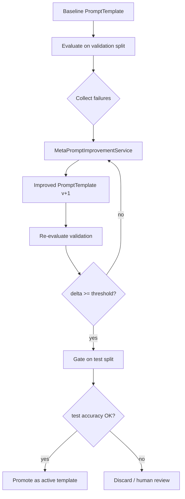

# Proposal: Auto LLM Prompt Improvement

**Version:** 1.0 (proposal)  
**Date:** 2026-06-16  
**Status:** Future scope — [PRD §18](PRD.md#18-future-scope-optional), milestones M9/M10  
**Related:** [PRD.md](PRD.md) · [TESTING.md](TESTING.md) · [USE_CASES.md](USE_CASES.md)

**Reference work analysed:**

- Report: [PRACTICAL_TASK_REPORT.md](https://github.com/berdachuk/ai-architect-6-tasks/blob/main/specialty-classification-reasoning/PRACTICAL_TASK_REPORT.md) ([`specialty-classification-reasoning`](https://github.com/berdachuk/ai-architect-6-tasks/tree/main/specialty-classification-reasoning))
- Code: `meta.ts`, `prompts.ts`, `evaluator.ts` in [ai-architect-6-tasks](https://github.com/berdachuk/ai-architect-6-tasks/tree/main/specialty-classification-reasoning/src)

---

## 1. Executive summary

The [HPE medical cases dataset](https://huggingface.co/datasets/hpe-ai/medical-cases-classification-tutorial) is used both by **medical-mcp-server** (retrieval MCP) and by the **specialty-classification-reasoning** CLI (prompt engineering lab). The CLI demonstrates that structured ReAct + self-reflection prompts outperform naive prompts (30 % → 80 % on small samples) and includes a **meta-prompting** loop where an LLM rewrites prompts automatically.

This proposal adds an **optional prompt-improvement subsystem** to medical-mcp-server that:

1. Reuses the same dataset splits ([train](https://huggingface.co/datasets/hpe-ai/medical-cases-classification-tutorial/blob/main/medical_cases_train.csv) / [validation](https://huggingface.co/datasets/hpe-ai/medical-cases-classification-tutorial/blob/main/medical_cases_validation.csv) / [test](https://huggingface.co/datasets/hpe-ai/medical-cases-classification-tutorial/blob/main/medical_cases_test.csv))
2. Ports proven patterns from `specialty-classification-reasoning` (evaluator, normalization, meta loop)
3. Feeds **failure analysis** back into meta-prompting (addressing the report’s +0 % meta delta)
4. Gates promotion on [TESTING.md](TESTING.md) validation/test methodology
5. Stays **off the default production MCP surface** — enabled only via `prompt-lab` profile

**Not changing:** medical-mcp-server remains a retrieval wrapper; classification is an **evaluatable agent workflow**, not a new production inference API.

---

## 2. Lessons from the practical task report

### 2.1 What worked

| Finding | Evidence | Implication for us |
|---|---|---|
| ReAct structure helps | bad 30 % → react 70 % (n=10) | Baseline templates should use Thought → Action → Observation → Answer |
| Self-reflection helps further | react_self_reflection ~80 % (best in compare) | Add explicit reflection phase before final answer |
| Measurable gold label | `medical_specialty` column | Same ground truth as MCP `list_specialties` labels |
| Parsed output contract | `PREDICTED_LABEL: <snake_case>` | Stable parser + normalization before compare |
| Compare workflow | `compare --limit 20` ranks variants | Need `compare_prompts` batch eval in prompt-lab |

### 2.2 What failed or needs improvement

| Finding | Evidence | Implication for us |
|---|---|---|
| Meta-prompting alone insufficient | bad → meta-improved: still 30 % (n=10) | Meta prompt must include **error examples**, label vocabulary, and dataset-specific constraints |
| Label format mismatch | `obstetrics_and_gynecology` vs `obstetrics_gynecology`, `cardiology` vs `cardiovascular_pulmonary` | Ship `SpecialtyLabelNormalizer` mapped to **exact 13 HF labels** (see PRD §2) |
| Small sample noise | limit=10 swings rankings | Use **validation** for tuning, **test** for gate (see TESTING.md) |
| Train-only eval in CLI | default `medical_cases_train.csv` | Align with our split discipline |

### 2.3 Code patterns to port

From [`meta.ts`](https://github.com/berdachuk/ai-architect-6-tasks/blob/main/specialty-classification-reasoning/src/meta.ts):

```typescript
// Meta-system asks LLM to rewrite prompt with ReAct + self-reflection
runMetaPrompting(client, model, currentPrompt) → improvedPrompt
```

From [`evaluator.ts`](https://github.com/berdachuk/ai-architect-6-tasks/blob/main/specialty-classification-reasoning/src/evaluator.ts):

```typescript
extractPredictedLabel(output)  // regex PREDICTED_LABEL
normalizeLabel(raw)            // SPECIALTY_NORMALIZATION map
computeSummary(results)        // accuracy + per-specialty
```

From [`prompts.ts`](https://github.com/berdachuk/ai-architect-6-tasks/blob/main/specialty-classification-reasoning/src/prompts.ts):

- Five variants: `bad`, `basic`, `react`, `self_reflection`, `react_self_reflection`
- Extensive `SPECIALTY_NORMALIZATION` — **trim** to our 13 HF labels only

---

## 3. Problem statement

Agents using medical-mcp-server (Claude Desktop, med-expert-match-ce) need **high-quality prompts** for specialty-oriented reasoning over retrieved cases. Today:

- `case-analysis` MCP prompt exposes dataset fields only (`focus=description|transcription|…`)
- No mechanism to **measure** or **improve** agent/system prompts against gold `medical_specialty`
- The standalone CLI proves prompt engineering value but is **disconnected** from the MCP dataset load and splits

**Goal:** Close the loop inside the same repo: load cases once → retrieve via MCP → evaluate/improve classification prompts with automated meta-prompting.

---

## 4. Proposed architecture

### 4.1 Optional `promptlab` Modulith module

```text
src/main/java/com/example/medicalmcp/
└── promptlab/                          @Profile("prompt-lab")
    ├── package-info.java               allowedDependencies: core, medicalcase, retrieval
    ├── domain/
    │   ├── PromptTemplate.java         id, name, version, systemText, createdAt
    │   ├── EvalResult.java
    │   └── EvalSummary.java
    ├── service/
    │   ├── PromptTemplateService.java
    │   ├── SpecialtyClassificationEvaluator.java
    │   ├── MetaPromptImprovementService.java
    │   └── PromptComparisonService.java
    ├── service/impl/
    ├── normalization/
    │   └── SpecialtyLabelNormalizer.java   # 13 HF labels ↔ snake_case
    ├── config/
    │   └── PromptLabProperties.java
    └── mcp/                            # only when profile active
        └── PromptLabTools.java
```

**Dependency rule:** `promptlab` may read cases via `MedicalCaseRepository` but must not be depended on by `mcp` production module.

### 4.2 Activation

```yaml
# application-prompt-lab.yml
spring:
  profiles:
    active: prompt-lab

medicalmcp:
  prompt-lab:
    enabled: true
    chat-model: ${PROMPT_LAB_CHAT_MODEL:qwen3.5:cloud}
    chat-base-url: ${PROMPT_LAB_CHAT_BASE_URL:http://localhost:11434}
    eval-split: validation          # tune here
    gate-split: test                # promote only if test passes
    default-limit: 50
    meta-temperature: 0.2
    eval-temperature: 0.0
    min-accuracy-delta: 0.05        # promote if validation +5% or more
    store-templates: true           # JDBC table prompt_template
```

Production MCP (`default` profile): **`medicalmcp.prompt-lab.enabled=false`** — no prompt-lab tools registered.

### 4.3 High-level flow



---

## 5. Enhanced meta-prompting (beyond the CLI)

The report’s meta step used only the raw prompt text. Proposed **context-rich meta prompt**:

```text
System: You are an expert clinical prompt engineer.

User:
## Current prompt
{currentPrompt}

## Allowed labels (exactly 13 — snake_case output)
{list from list_specialties / PRD §2}

## Validation accuracy
{accuracy}% ({correct}/{total})

## Per-specialty errors (confusion)
{gold: cardiovascular_pulmonary, predicted: orthopedic, count: 3}
...

## Example failure cases (anonymized ids)
Case UUID: ...
Description: ...
Gold specialty: Neurology
Model output excerpt: ...
Predicted: cardiovascular_pulmonary

## Task
Rewrite the prompt to:
1. Use ReAct (Thought → Action → Observation → Answer)
2. Add self-reflection before final label
3. Constrain output to: PREDICTED_LABEL: <one_of_allowed_labels>
4. Address the confusion patterns above

Return ONLY the improved system prompt text.
```

This addresses the report’s **+0 % meta delta** by giving the meta-LLM concrete failure signal.

---

## 6. Proposed MCP tools (`@Profile("prompt-lab")` only)

| Tool | Purpose | Dataset split |
|---|---|---|
| `evaluate_specialty_prompt` | Run `systemPrompt` on N cases; return accuracy + per-specialty breakdown | param `split` default `validation` |
| `improve_specialty_prompt` | Meta-improve prompt using last eval failures; returns new template text + version id | — |
| `compare_specialty_prompts` | Run multiple template ids or inline prompts; ranked table | `validation` |
| `gate_specialty_prompt` | Run promoted candidate on **test** split; return pass/fail vs threshold | `test` only |
| `list_prompt_templates` | Versioned stored templates | — |

**Input case text** (same as CLI `getCaseText`):

```text
{sample_name}. {description}
{transcription}
Keywords: {keywords}   # omit if null
```

**Output contract** (unchanged from reference project):

```text
PREDICTED_LABEL: cardiovascular_pulmonary
```

**Normalization:** Map predictions and gold labels to canonical snake_case, then map to **exact HF label** for comparison:

```text
cardiovascular_pulmonary → "Cardiovascular / Pulmonary"
ent_otolaryngology       → "ENT - Otolaryngology"
```

### 6.1 Relationship to existing MCP tools

| Existing tool | Role in prompt-lab workflow |
|---|---|
| `get_case` | Fetch full case for manual debugging |
| `search_cases` | Find confusion-cluster examples for few-shot injection |
| `list_specialties` | Inject allowed labels into meta prompt |
| `case-analysis` | **Separate** — field-focused LLM template, not classification eval |

---

## 7. Evaluation methodology (aligned with TESTING.md)

| Phase | Split | CSV | Purpose |
|---|---|---|---|
| Development | train (sample) | `medical_cases_train.csv` | Fast iteration, unit fixtures |
| Meta-tuning | **validation** | `medical_cases_validation.csv` | Improve prompt, accept/reject delta |
| Promotion gate | **test** | `medical_cases_test.csv` | Final accuracy gate — never used in meta loop |
| Retrieval quality | test | (existing) | FTS / semantic metrics unchanged |

### Metrics (classification prompt quality)

| Metric | Formula | Initial gate (test) |
|---|---|---|
| Accuracy | correct / total | ≥ 0.55 (baseline) → target ≥ 0.70 with react_self_reflection class |
| Macro-F1 | across 13 labels | ≥ 0.50 |
| Per-specialty recall | min over labels with n≥5 | ≥ 0.40 |
| Delta vs baseline | acc_new - acc_bad | ≥ +0.05 on validation to attempt promotion |

Store JSON artifacts like the CLI (`results/eval_*.json`):

```text
target/prompt-lab/eval_{templateId}_{timestamp}.json
```

### Integration with quality CI

Extend [TESTING.md](TESTING.md) profile `quality`:

```bash
mvn verify -Pquality -Pprompt-lab
# Runs SemanticRetrievalQualityTest + PromptLabGateTest (test split)
```

---

## 8. Default prompt template library

Port and adapt variants from [`prompts.ts`](https://github.com/berdachuk/ai-architect-6-tasks/blob/main/specialty-classification-reasoning/src/prompts.ts):

| Template id | Origin | Expected accuracy (report) |
|---|---|---|
| `bad` | CLI bad | ~30 % |
| `basic` | CLI basic | ~40 % |
| `react` | CLI react | ~70 % |
| `self_reflection` | CLI self_reflection | variable |
| `react_self_reflection` | CLI best | ~80 % |

**Adaptations for medical-mcp-server:**

1. Replace generic specialty list with **exact 13 HF labels** from PRD §2
2. Add line: *“Use only retrieval context if provided; base decision on case text below.”*
3. Optional: inject top-3 `semantic_search` results as context (med-expert-match-ce pattern)

Seed SQL or classpath `promptlab/templates/*.md` on first run.

---

## 9. Implementation phases

| Phase | Deliverable | Milestone |
|---|---|---|
| **P1** | `SpecialtyLabelNormalizer`, `PromptTemplate` domain, JDBC table `prompt_template` | PRD M9 |
| **P2** | `SpecialtyClassificationEvaluator` (chat client, parse label, summary) | PRD M9 |
| **P3** | `MetaPromptImprovementService` with failure-context meta prompt | PRD M9 |
| **P4** | `PromptLabTools` MCP + `application-prompt-lab.yml` | PRD M9 |
| **P5** | `PromptLabGateTest` on test CSV; CI nightly | TESTING.md + PRD M9 |
| **P6** | Optional: wire best template into `case-analysis` as `focus=specialty` hint | PRD M10 |

**Chat model wiring:** Separate from embedding pool — use `spring.ai.ollama.chat` or OpenAI-compatible chat client (same Ollama host, different model e.g. `qwen3.5:cloud` per report).

---

## 10. Example workflows

### W1 — Replicate report baseline

```text
1. evaluate_specialty_prompt(templateId="bad", split="validation", limit=10)
2. evaluate_specialty_prompt(templateId="react", split="validation", limit=10)
3. compare_specialty_prompts(templateIds=["bad","react","react_self_reflection"], limit=20)
```

### W2 — Auto-improve with failure context

```text
1. evaluate_specialty_prompt(templateId="bad", split="validation", limit=50, saveRunId=true)
2. improve_specialty_prompt(baseTemplateId="bad", evalRunId=<id>)
   → returns templateId="bad-meta-v1"
3. evaluate_specialty_prompt(templateId="bad-meta-v1", split="validation", limit=50)
4. gate_specialty_prompt(templateId="bad-meta-v1", split="test")
```

### W3 — Agent loop (med-expert-match-ce)

```text
1. semantic_search(query=userQuestion, specialty=...)
2. get_case(id=topHit)
3. evaluate_specialty_prompt on single case (debug) OR use promoted template in agent system prompt
```

---

## 11. Risks and mitigations

| Risk | Mitigation |
|---|---|
| Meta-prompt does not improve (report +0 %) | Failure-context meta prompt; multiple iterations; human review queue |
| Label alias errors | `SpecialtyLabelNormalizer` + unit tests for all 13 HF strings |
| Scope creep into production classifier | `prompt-lab` profile off by default; not a patient-facing endpoint |
| LLM non-determinism | `temperature=0` for eval; seed + store full `modelOutput` in JSON |
| Cost / latency | limit N; async batch; cache case text embeddings separately from chat |
| Conflicts with PRD non-goals | Document as **evaluation/lab** tooling, not “server classifies patients” |

---

## 12. Open decisions

| # | Question | Recommendation |
|---|---|---|
| D1 | MCP tools vs standalone CLI submodule? | MCP tools under `prompt-lab` profile + optional thin CLI wrapper for CI |
| D2 | Store templates in DB or Git? | DB with version ids; export to `promptlab/templates/*.md` on promote |
| D3 | Couple to `case-analysis` prompt? | Yes — optional `templateId` arg after P6 |
| D4 | Minimum test accuracy to ship template? | Start 0.55 gate; raise to 0.65 after baseline established |

---

## 13. Success criteria

- [ ] Reproduce report ranking on validation: `react_self_reflection` > `react` > `bad`
- [ ] Meta-improvement with failure context achieves **≥ +5 %** on validation vs `bad` in ≥ 50 % of runs
- [ ] Promoted template passes **test** split gate without tuning on test
- [ ] Zero impact on default MCP tool list when `prompt-lab` profile disabled
- [ ] Modulith `verify()` passes with `promptlab` module boundaries

---

## 14. Related documentation

- [USE_CASES.md](USE_CASES.md) — retrieval workflows (unchanged for production)
- [TESTING.md](TESTING.md) — split discipline and quality gates
- [PRACTICAL_TASK_REPORT.md](https://github.com/berdachuk/ai-architect-6-tasks/blob/main/specialty-classification-reasoning/PRACTICAL_TASK_REPORT.md) — empirical prompt rankings
- [specialty-classification-reasoning README](https://github.com/berdachuk/ai-architect-6-tasks/tree/main/specialty-classification-reasoning) — CLI reference implementation
