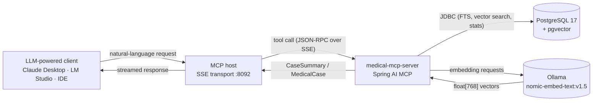
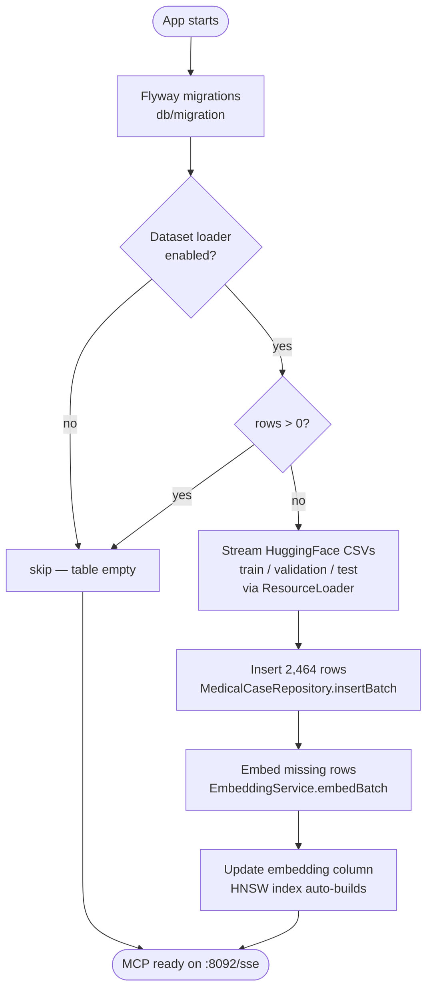
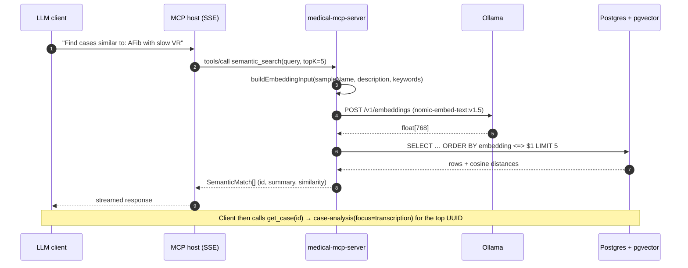
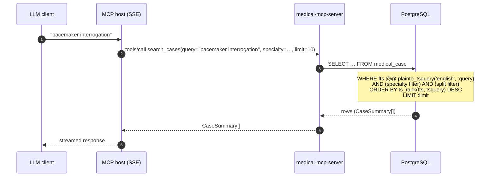

# MCP user guide

**Version:** 1.0  
**Server:** `medical-mcp-server`  
**Endpoint:** `http://localhost:8092/sse` (SSE transport)

This guide explains how to **use** the production MCP surface: tools, resources, and the `case-analysis` prompt. Normative API details live in [01-requirements.md §6](../01-requirements.md#6-mcp-surface).

---

## What this server does

medical-mcp-server wraps the [HPE medical cases dataset](https://huggingface.co/datasets/hpe-ai/medical-cases-classification-tutorial) (2,464 rows, 13 specialties). It exposes **search and retrieval** over stored dataset fields — not a production specialty-classification API.

| Capability  |              Count  |
|-------------|--------------------:|
| Tools       |                   5 |
| Resources   |                   2 |
| Prompts     | 1 (`case-analysis`) |
| Completions |                   0 |

---

## Before you start

### Prerequisites

- **PostgreSQL 17 + pgvector** — data store and vector index
- **Ollama** with `nomic-embed-text:v1.5` pulled — required for `semantic_search` embeddings
- Server running via [Docker Compose](../05-deployment.md) or `mvn spring-boot:run`

### First startup

On a fresh database the server downloads HuggingFace CSVs and runs a two-pass load (rows, then embeddings). This can take several minutes. FTS (`search_cases`) works after pass 1; semantic search needs pass 2 complete.

### Health check

```bash
curl http://localhost:8092/actuator/health
```

Expect `"status":"UP"` when Postgres and embeddings are reachable.

---

## How the application works

Three views of the same system: the runtime request path, the one-time startup ingest, and a concrete `semantic_search` sequence.

### Request flow at a glance



Key points:

- **MCP is the only external contract.** No REST API is exposed on the default profile ([§01-requirements](../01-requirements.md)).
- **Postgres holds both the rows and the vectors** — pgvector (HNSW cosine) for similarity, a GIN index for FTS.
- **Embeddings are on demand.** The server only calls Ollama when a tool needs to embed a query (i.e. `semantic_search`). Dataset rows are embedded once at startup.

### Startup and dataset ingest



Idempotency is enforced by `COUNT(*)` ([DatasetLoaderServiceImpl](../../src/main/java/com/example/medicalmcp/dataset/service/impl/DatasetLoaderServiceImpl.java:50)). A clean reload requires wiping the volume (`docker compose … down -v`) — see the project [README](../../README.md#where-the-database-lives).

### Semantic search — sequence



`search_cases` skips the Ollama hop — it goes straight to Postgres FTS.

---

## The 13 specialty labels

Filters on `search_cases` and `semantic_search` require the **exact** `medical_specialty` string from the dataset. Copy from this table or from `list_specialties`.

| Specialty label            | Full-dataset count  |
|----------------------------|--------------------:|
| Cardiovascular / Pulmonary |                 742 |
| Orthopedic                 |                 408 |
| Neurology                  |                 282 |
| Gastroenterology           |                 222 |
| Obstetrics / Gynecology    |                 182 |
| Hematology - Oncology      |                 120 |
| Neurosurgery               |                 109 |
| ENT - Otolaryngology       |                  80 |
| Nephrology                 |                  71 |
| Psychiatry / Psychology    |                  68 |
| Ophthalmology              |                  66 |
| Pediatrics - Neonatal      |                  64 |
| Radiology                  |                  50 |

**Common mistakes**

| Wrong                       | Correct                      |
|-----------------------------|------------------------------|
| `Cardiology`                | `Cardiovascular / Pulmonary` |
| `Obstetrics and Gynecology` | `Obstetrics / Gynecology`    |
| `ENT`                       | `ENT - Otolaryngology`       |

---

## Tools

### `search_cases` — full-text search

Keyword search across `sample_name`, `description`, `transcription`, and `keywords` (PostgreSQL FTS).

| Parameter   | Required  | Description                             |
|-------------|-----------|-----------------------------------------|
| `query`     | Yes       | Search terms                            |
| `specialty` | No        | Exact specialty label (see table above) |
| `split`     | No        | `train` \| `validation` \| `test`       |
| `limit`     | No        | Default 10, max 50                      |

**Example use:** *Find cases mentioning pacemaker interrogation*

```
search_cases(query="pacemaker interrogation", limit=10)
```

**Returns:** `CaseSummary[]` — `id`, `sampleName`, `description`, `medicalSpecialty`, `keywords`, `split`. No `transcription` in summaries.

**When to use:** Exact terms, procedure names, or phrases that appear in long clinical notes. Best for transcription-heavy queries.

**How it works (PostgreSQL FTS):** the `medical_case` table has a generated `fts` column of type `TSVECTOR` that Postgres maintains automatically from `sample_name + description + transcription + keywords` (English text-search config). `search_cases` runs `plainto_tsquery('english', :query) @@ fts` against a GIN index, then `ORDER BY ts_rank(fts, …) DESC`. That gives stemming ("interrogating" hits "interrogation"), ranking, and sub-millisecond lookups. See [docs/03-design.md §The `fts` column](../03-design.md#the-fts-column) for the schema detail.



---

### `semantic_search` — vector similarity

Embeds the query with `nomic-embed-text:v1.5` and searches pgvector (cosine similarity).

| Parameter       | Required  | Description                             |
|-----------------|-----------|-----------------------------------------|
| `query`         | Yes       | Free-text clinical question or scenario |
| `specialty`     | No        | Pre-filter by exact specialty label     |
| `topK`          | No        | Default 5                               |
| `minSimilarity` | No        | Default 0.70 (0.0–1.0)                  |

**Example use:** *Find cases clinically similar to atrial fibrillation with slow ventricular response*

```
semantic_search(query="patient with atrial fibrillation and slow ventricular response", topK=5)
```

**Returns:** `SemanticMatch[]` — `{ caseSummary, similarity }`.

**Index note:** Embeddings are built from `{sampleName}. {description} {keywords}` — **not** full `transcription`. For transcription terms, combine with `search_cases` or fetch `get_case` after semantic hits.

**Latency:** First query may be slower (embedding call to Ollama). Progress notifications: 0 % → 50 % (after embed) → 100 %.

---

### `get_case` — full record by UUID

| Parameter  | Required  | Description                                                      |
|------------|-----------|------------------------------------------------------------------|
| `id`       | Yes       | Server UUID from `search_cases`, `semantic_search`, or resources |

**Example:**

```
get_case(id="550e8400-e29b-41d4-a716-446655440000")
```

**Returns:** Full `MedicalCase` — all HuggingFace columns plus `id`, `split`, `createdAt`, including **`transcription`**.

**Important:** `sample_name` is not unique. Always use the UUID from tool results.

---

### `list_specialties`

No parameters. Returns `[{ specialty, count }]` for all labels present in the loaded data.

**Example use:** Discover exact specialty strings before filtering.

---

### `get_dataset_stats`

No parameters. Returns `{ totalCases, bySpecialty, bySplit }`. Cached 60 seconds.

**Example use:** Confirm the dataset finished loading (2,464 rows on full load).

---

## Resources

MCP resources expose the same data for clients that prefer URI-based attachment.

| URI                      | Content                                                   |
|--------------------------|-----------------------------------------------------------|
| `medical://cases/{uuid}` | Full case JSON (includes `transcription`)                 |
| `medical://stats`        | Dataset statistics snapshot (same as `get_dataset_stats`) |

**When to use resources:** Claude Desktop or agents that attach case JSON as context without a separate `get_case` tool call.

---

## Prompt — `case-analysis`

Structured LLM template injecting dataset fields from one case. **No completion handler** on the server — your MCP host runs the model.

| Argument  | Required  | Description                                                                      |
|-----------|-----------|----------------------------------------------------------------------------------|
| `caseId`  | Yes       | UUID from search tools                                                           |
| `focus`   | No        | `description` \| `transcription` \| `keywords` \| `specialty` \| `all` (default) |

### Focus modes

| `focus`         | Fields included                                                                              |
|-----------------|----------------------------------------------------------------------------------------------|
| `description`   | Short visit summary                                                                          |
| `transcription` | Full clinical note                                                                           |
| `keywords`      | Keyword line (omitted if null)                                                               |
| `specialty`     | Description + transcription + keywords + specialty label + **promoted classification block** |
| `all`           | Specialty, description, transcription, keywords                                              |

### `focus=specialty` (M10)

Adds the prompt-lab winner (`react_self_reflection`): ReAct + self-reflection instructions and the `PREDICTED_LABEL: <label>` output contract. Shared text lives in `PromotedSpecialtyClassificationInstructions`.

Other focus values remain dataset-field templates only.

### Typical pipeline

```
1. search_cases(query="pacemaker", limit=5)
2. case-analysis(caseId="<uuid>", focus="transcription")
```

---

## Worked workflows

### W1 — Find and summarize a cardiology case

```
1. list_specialties()                                    # confirm exact label
2. search_cases(query="chest pain", specialty="Cardiovascular / Pulmonary", limit=5)
3. get_case(id="<uuid-from-step-2>")
4. case-analysis(caseId="<uuid>", focus="description")
```

### W2 — Semantic search → deep note review

```
1. semantic_search(query="pacemaker device check", topK=3)
2. get_case(id="<top-match-uuid>")
3. case-analysis(caseId="<uuid>", focus="transcription")
```

### W3 — Specialty classification study

```
1. search_cases(query="patient", split="validation", limit=1)
2. case-analysis(caseId="<uuid>", focus="specialty")
```

Inspect the promoted block and compare model output to the dataset `medical_specialty` field.

---

## Troubleshooting

| Symptom                              | Likely cause                      | Fix                                   |
|--------------------------------------|-----------------------------------|---------------------------------------|
| Empty `semantic_search` results      | Embeddings missing or Ollama down | Check Ollama; wait for loader pass 2  |
| `get_case` returns null              | Invalid or malformed UUID         | Copy `id` from search results         |
| Empty FTS with specialty filter      | Wrong specialty string            | Use `list_specialties` labels exactly |
| Slow first semantic query            | Cold embedding + DB               | Normal; subsequent calls faster       |
| `keywords` section missing in prompt | Field is null in dataset          | Expected for ~36 % of rows            |

---

## Related documentation

- [use-cases.md](../use-cases.md) — full use-case catalog (UC-T*, UC-R*, UC-P*)
- [04-testing.md §11](../04-testing.md#11-manual-smoke-checklist-m7) — automated smoke checklist
- [lm-studio-mcp-manual-test.md](lm-studio-mcp-manual-test.md) — manual testing with LM Studio
- [05-deployment.md](../05-deployment.md) — Docker, env vars, Claude Desktop config
- [claude-desktop-mcp.md](claude-desktop-mcp.md) — Claude Desktop manual smoke test
